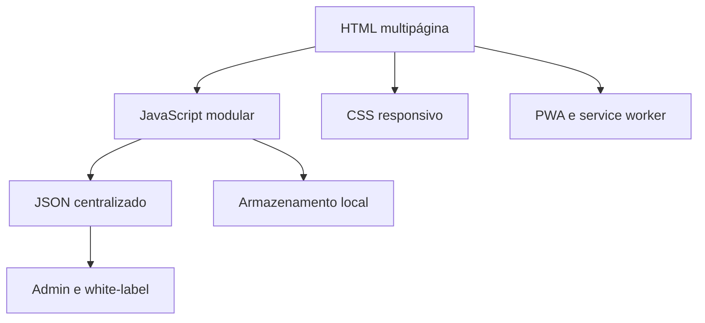

# Saúde Qualimax

[](https://github.com/jplima-dev-ai/saude-quali-max/actions/workflows/quality.yml)
[](https://github.com/jplima-dev-ai/saude-quali-max/actions/workflows/pages.yml)

**Versão 3.8.9 — plataforma estática, acessível e white-label para lojas de produtos naturais.**

[Ver demonstração](https://jplima-dev-ai.github.io/saude-quali-max/) · [Portfólio técnico](docs/PORTFOLIO.md) · [Estudo de caso](docs/CASE-STUDY.md) · [Arquitetura](docs/ARCHITECTURE.md) · [Guia de demonstração](docs/DEMO-GUIDE.md)


## Por que este projeto existe

Pequenos comércios precisam apresentar muitos produtos, orientar pessoas com diferentes necessidades e preparar o atendimento sem assumir o custo ou o risco de uma operação transacional completa. A Saúde Qualimax resolve esse recorte com uma aplicação multipágina orientada por dados, executada integralmente no navegador e pronta para receber outra marca.

O projeto foi desenvolvido por **João Paulo Lima**, desenvolvedor cego e usuário de NVDA. A acessibilidade não é uma camada posterior: ela influencia a arquitetura, os textos, os testes e cada jornada por teclado.

## O que chama atenção tecnicamente

| Dimensão             | Evidência no repositório                                                                          |
| -------------------- | ------------------------------------------------------------------------------------------------- |
| Escala estática      | 81 páginas HTML, incluindo 60 páginas de produto                                                  |
| Arquitetura de dados | catálogo, identidade, rotas, FAQ e configurações em JSON                                          |
| Acessibilidade       | HTML semântico, foco previsível, anúncios de status, redução de movimento e testes Axe/Playwright |
| White-label          | Admin Studio e White-label Studio com exportação local e configuração centralizada                |
| Experiência          | catálogo, comparação, carrinho demonstrativo, Central de Bem-Estar e Max contextual               |
| Privacidade          | dados de jornada permanecem no dispositivo; WhatsApp só abre após ação voluntária                 |
| Qualidade            | testes Python, Node, validação de todos os JavaScripts/JSON e CI no GitHub Actions                |
| Entrega              | build determinístico, PWA/offline e publicação automática no GitHub Pages                         |

Os números são verificados automaticamente em [`docs/project-metrics.json`](docs/project-metrics.json). `npm run metrics` falha quando documentação e código deixam de representar o mesmo estado.

## Experimente em cinco minutos

1. Navegue só com `Tab`, `Shift+Tab`, `Enter` e `Esc`.
2. Abra o catálogo, pesquise e adicione um produto ao carrinho.
3. Abra o Max, faça uma pergunta e feche o diálogo para conferir o retorno do foco.
4. Visite a Central de Bem-Estar e o comparador.
5. Abra o Admin Studio e o White-label Studio, lembrando que ambos são ferramentas locais demonstrativas, não áreas autenticadas.

## Arquitetura



Não há backend próprio, autenticação remota, pagamento, estoque central ou pedido transacional. Preço, disponibilidade e condições comerciais são confirmados pela loja.

## Executar localmente

Pré-requisitos: Python 3.12+ e Node.js 20+. Em uma cópia nova, instale também as dependências Python declaradas no projeto.

```bash
npm install
npm run setup:python
npm run dev
```

Abra `http://127.0.0.1:8000`. No Windows, os mesmos comandos funcionam no terminal integrado do VS Code.

## Verificar qualidade

```bash
npm test                 # suíte estrutural e comportamental
npm run test:e2e:install # instala o Chromium uma vez
npm run test:e2e         # desktop, celular e Axe
npm run screenshots      # cinco capturas reproduzíveis
npm run test:release     # três rodadas para uma release
npm run build            # gera _site/ para publicação
```

O plano manual com NVDA está em [`docs/NVDA-TEST-PLAN.md`](docs/NVDA-TEST-PLAN.md). Testes automatizados não substituem a validação por leitor de tela.

## Estrutura

```text
assets/       estilos, scripts e imagens otimizadas
data/         catálogo e configurações centralizados
products/     páginas geradas dos 60 produtos
tests/e2e/    jornadas reais com Playwright e Axe
tools/        sincronização, build, auditorias e testes históricos
docs/         arquitetura, decisões e evidências
.github/      CI, publicação, issues e pull requests
```

As páginas em `products/` são geradas por `tools/sync-client.py`; altere o catálogo em `data/products.json`, nunca o HTML gerado isoladamente.

## Decisões e limites

- HTML/CSS/JavaScript sem framework preservam baixo custo, hospedagem estática e fácil revenda.
- Informações comerciais e identidade ficam centralizadas para reduzir divergências.
- O Admin Studio edita/exporta dados locais; não deve ser apresentado como painel seguro de produção.
- O Max é local e contextual; não envia conversas para um serviço externo.
- O projeto usa uma licença de portfólio, não uma licença open source. Consulte [`LICENSE.md`](LICENSE.md).

## Documentação essencial

- [`docs/CASE-STUDY.md`](docs/CASE-STUDY.md) — problema, processo, decisões e resultados;
- [`docs/PORTFOLIO.md`](docs/PORTFOLIO.md) — apresentação, competências e conversa de entrevista;
- [`docs/RELEASES.md`](docs/RELEASES.md) — tags, pacote e SHA-256 automáticos;
- [`docs/adr/`](docs/adr/) — decisões arquiteturais registradas;
- [`docs/GITHUB-PUBLISHING.md`](docs/GITHUB-PUBLISHING.md) — publicação pelo VS Code e GitHub Pages;
- [`docs/QUALITY-EVIDENCE-V380.md`](docs/QUALITY-EVIDENCE-V380.md) — matriz de validação da release;
- [`docs/MODULE-MAP.md`](docs/MODULE-MAP.md) — mapa dos módulos ativos;
- [`SECURITY.md`](SECURITY.md) e [`docs/PRIVACY.md`](docs/PRIVACY.md) — segurança e privacidade;
- [`docs/CHANGELOG.md`](docs/CHANGELOG.md) — histórico consolidado.

## Autor

**João Paulo Lima** — [GitHub](https://github.com/jplima-dev-ai)

Feedback técnico e de acessibilidade é bem-vindo por meio das issues do repositório.
