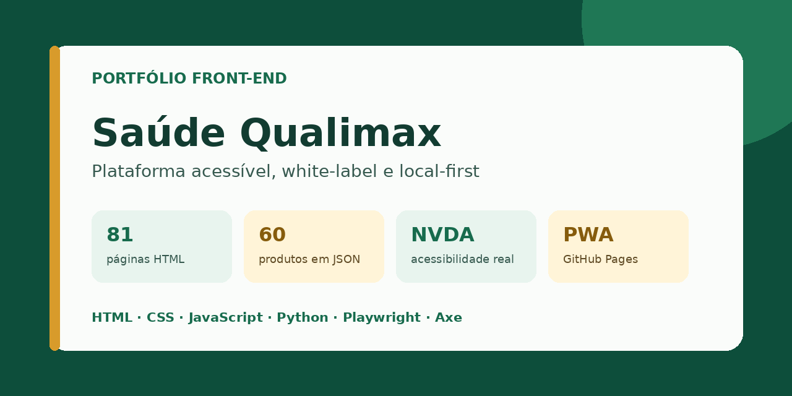
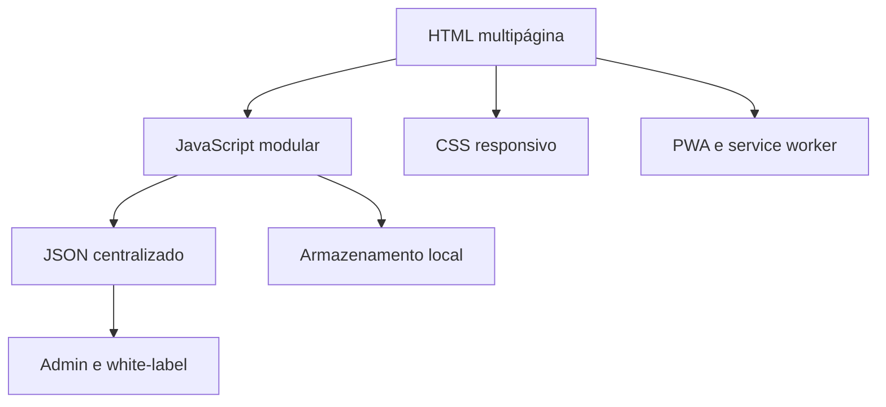

# Saúde Qualimax

[](https://github.com/jplima-dev-ai/saude-quali-max/actions/workflows/quality.yml)
[](https://github.com/jplima-dev-ai/saude-quali-max/actions/workflows/pages.yml)


**Plataforma web acessível e white-label para e-commerce demonstrativo, com arquitetura orientada a dados, PWA, Playwright, Axe e CI/CD.**

[Ver demonstração](https://jplima-dev-ai.github.io/saude-quali-max/) · [Estudo de caso](docs/CASE-STUDY.md) · [Portfólio técnico](docs/PORTFOLIO.md) · [Arquitetura](docs/ARCHITECTURE.md) · [Guia de demonstração](docs/DEMO-GUIDE.md)



## Visão rápida para recrutadores

A Saúde Qualimax demonstra uma entrega front-end completa, não apenas páginas visuais. O repositório reúne **81 páginas HTML**, **60 produtos orientados por JSON**, experiência white-label, PWA/offline, testes automatizados, auditorias de acessibilidade e pipelines de qualidade/publicação no GitHub Actions.

| Área           | Evidência verificável                                                                     |
| -------------- | ----------------------------------------------------------------------------------------- |
| Front-end      | HTML semântico, CSS responsivo e JavaScript modular sem framework obrigatório             |
| Acessibilidade | navegação por teclado, foco previsível, redução de movimento, Axe e plano manual com NVDA |
| Qualidade      | testes Python/Node, Playwright desktop/mobile, métricas reproduzíveis e CI                |
| Arquitetura    | catálogo, identidade, rotas, FAQ e configurações centralizados em JSON                    |
| Produto        | catálogo, comparação, carrinho demonstrativo, Central de Bem-Estar e Max contextual       |
| White-label    | Admin Studio e White-label Studio com edição/exportação local                             |
| Entrega        | build determinístico, PWA/offline, GitHub Pages e release com SHA-256                     |
| Privacidade    | jornada local-first e saída para WhatsApp somente após ação voluntária                    |

Os números oficiais são calculados por [`docs/project-metrics.json`](docs/project-metrics.json). `npm run metrics` falha quando código e documentação deixam de representar o mesmo estado.

## Por que este projeto existe

Pequenos comércios precisam apresentar muitos produtos, orientar pessoas com diferentes necessidades e preparar o atendimento sem assumir o custo ou o risco de uma operação transacional completa. A Saúde Qualimax resolve esse recorte com uma aplicação multipágina orientada por dados, executada integralmente no navegador e pronta para receber outra marca.

A acessibilidade é tratada como requisito de engenharia: influencia semântica, foco, mensagens de status, movimento, contraste e os contratos de teste. Testes automatizados complementam — e não substituem — a validação manual com leitor de tela.

## Experimente em cinco minutos

1. Navegue somente com `Tab`, `Shift+Tab`, `Enter` e `Esc`.
2. Abra o catálogo, pesquise e adicione um produto ao carrinho.
3. Abra o Max, faça uma pergunta e feche o diálogo para conferir o retorno do foco.
4. Visite a Central de Bem-Estar e o comparador.
5. Abra o Admin Studio e o White-label Studio; ambos são ferramentas locais demonstrativas, não áreas autenticadas.

## Arquitetura



Não há backend próprio, autenticação remota, pagamento, estoque central ou pedido transacional. Preço, disponibilidade e condições comerciais são confirmados pela loja.

## Stack e práticas

`HTML5` · `CSS3` · `JavaScript` · `Python` · `JSON` · `PWA` · `Playwright` · `Axe Core` · `GitHub Actions` · `GitHub Pages` · `NVDA` · `WCAG`

## Executar localmente

Pré-requisitos: Python 3.12+ e Node.js 20+.

```bash
npm install
npm run setup:python
npm run dev
```

Abra `http://127.0.0.1:8000`.

## Verificar qualidade

```bash
npm test                 # suíte estrutural, sintaxe e contratos históricos
npm run test:e2e:install # instala o Chromium uma vez
npm run test:e2e         # desktop, mobile e Axe
npm run screenshots      # cinco capturas reproduzíveis
npm run test:release     # três rodadas para uma release
npm run build            # gera _site/ para publicação
```

O plano manual com NVDA está em [`docs/NVDA-TEST-PLAN.md`](docs/NVDA-TEST-PLAN.md).

## Estrutura

```text
assets/       estilos, scripts e imagens otimizadas
data/         catálogo e configurações centralizados
products/     páginas geradas dos 60 produtos
tests/e2e/    jornadas reais com Playwright e Axe
tools/        sincronização, build, auditorias e testes históricos
docs/         arquitetura, decisões, portfólio e evidências
.github/      CI, publicação, releases, issues e pull requests
```

As páginas em `products/` são geradas por `tools/sync-client.py`; altere o catálogo em `data/products.json`, nunca o HTML gerado isoladamente.

## Decisões e limites

- HTML/CSS/JavaScript sem framework preservam baixo custo, hospedagem estática e fácil adaptação.
- Informações comerciais e identidade ficam centralizadas para reduzir divergências.
- O Admin Studio edita/exporta dados locais; não é apresentado como painel seguro de produção.
- O Max é local e contextual; não envia conversas silenciosamente para serviço externo.
- O projeto usa uma licença de portfólio, não uma licença open source. Consulte [`LICENSE.md`](LICENSE.md).

## Documentação essencial

- [`docs/CASE-STUDY.md`](docs/CASE-STUDY.md) — problema, decisões, implementação e resultado;
- [`docs/PORTFOLIO.md`](docs/PORTFOLIO.md) — competências demonstradas e conversa de entrevista;
- [`docs/REPOSITORY-PRESENTATION.md`](docs/REPOSITORY-PRESENTATION.md) — About, topics e Social Preview;
- [`docs/RELEASE-NOTES-V390.md`](docs/RELEASE-NOTES-V390.md) — resumo técnico da versão 3.9.0;
- [`docs/RELEASES.md`](docs/RELEASES.md) — tags, pacote e SHA-256 automáticos;
- [`docs/adr/`](docs/adr/) — decisões arquiteturais registradas;
- [`docs/NVDA-TEST-PLAN.md`](docs/NVDA-TEST-PLAN.md) — validação manual com leitor de tela;
- [`docs/QUALITY-EVIDENCE-V390.md`](docs/QUALITY-EVIDENCE-V390.md) — evidências da release 3.9.0;
- [`docs/MODULE-MAP.md`](docs/MODULE-MAP.md) — mapa dos módulos ativos;
- [`SECURITY.md`](SECURITY.md) e [`docs/PRIVACY.md`](docs/PRIVACY.md) — segurança e privacidade;
- [`docs/CHANGELOG.md`](docs/CHANGELOG.md) — histórico consolidado.

## Autor

**João Paulo Lima** — [GitHub](https://github.com/jplima-dev-ai)

Feedback técnico e de acessibilidade é bem-vindo por meio das issues do repositório.
